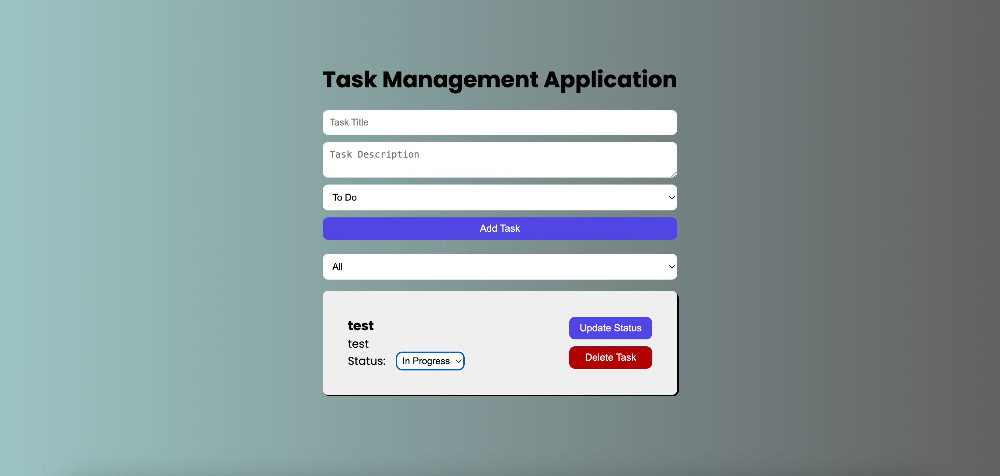

# full-stack-developer-challenge-pesto


## Introduction

This is a full-stack task management application built with Next.js for the front-end and Node.js with Express for the back-end. The application allows users to create, update, and delete tasks with a title, description, and status. Users can also filter tasks by status.

## Table of Contents

- [Introduction](#introduction)
- [Features](#features)
- [Technologies Used](#technologies-used)
- [Setup Instructions](#setup-instructions)
- [API Endpoints](#api-endpoints)
- [Screenshots](#screenshots)
- [Notes](#notes)

## Features

### Front-End

- User-friendly interface for managing tasks.
- Form to create new tasks.
- List of tasks with options to update status or delete.
- Filter tasks by status (All, To Do, In Progress, Done).
- Responsive design for desktop and mobile devices.

### Back-End

- RESTful API for task CRUD operations.
- MongoDB for data storage.
- Server-side validation and error handling.

## Technologies Used

- **Front-End**: Next.js, React, SCSS
- **Back-End**: Node.js, Express, MongoDB

## Setup Instructions

Prerequisites
Node.js (>= 14.x)
MongoDB (running locally or using a cloud service like MongoDB Atlas)

## Back-End Setup

- Navigate to the backend directory:

```
cd backend
```

- Install dependencies:

```
yarn
```
 
- Create a .env file in the backend directory and add your MongoDB URI:

plaintext
MONGODB_URI= your MONGO_DB URI

- Start the server:

```
yarn dev
```

## Front-End Setup

- Navigate to the frontend directory:

```
cd frontend
```

- Install dependencies:

```
yarn
```

- Start the development server:

```
yarn dev
```

## Running the Application

- The front-end will be running on http://localhost:3000.
- The back-end API will be running on http://localhost:5002.

## API Endpoints

### Task Endpoints

GET /api/tasks : Get all tasks
GET /api/tasks/ : Get a task by ID
POST /api/tasks : Create a new task
PUT /api/tasks/ : Update a task
DELETE /api/tasks/ : Delete a task


## Screenshots




### Notes:

- Update the MongoDB URI in the `.env` file with your actual MongoDB connection string.